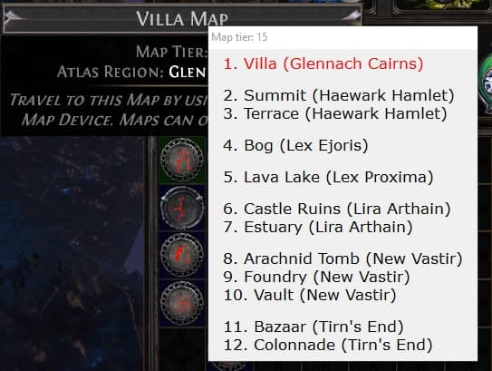

# PoE-Horizon-Orb-Helper
[Path of Exile](https://www.pathofexile.com/) utility that shows you all possible outcomes of applying [Orb of Horizons](https://pathofexile.fandom.com/wiki/Orb_of_Horizons) on a specific map.

Example:

## Usage

1. Download the project as _.zip_ and unpack
2. Run **HorizonOrbHelper.ahk**
3. In game press **Ctrl+H** when hovering over a map
4. Move mouse to dismiss the tooltip

## Prerequisites
* [AutoHotkey](https://www.autohotkey.com/)
* Windows
* English client
